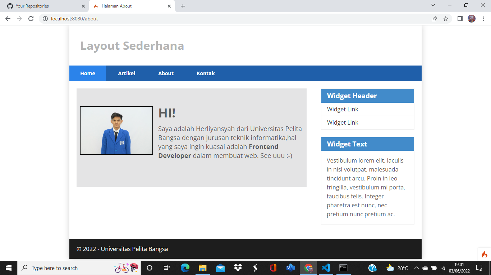
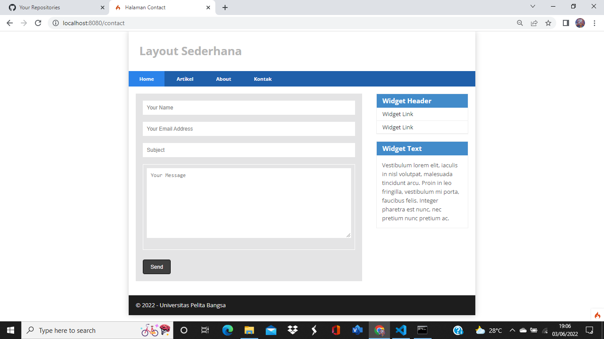
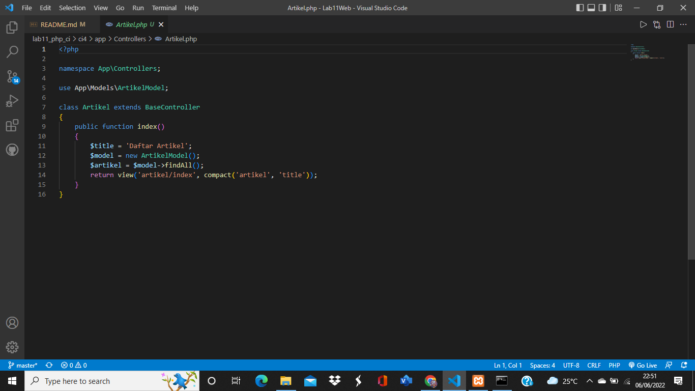

|   HERLIYANSYAH        |       312010387       |
|-----------------------|-----------------------|
|    TI.20.A.2          |   PEMROGRAMAN WEB     |
|   PERTEMUAN 12        |   PRAKTIKUM 11        |

## PERTEMUAN 12

## LAB 11 WEB

## PRAKTIKUM 11

Dipertemuan kali ini kita akan mempelajari **PHP** **FRAMEWORK** **(CODEIGNITER)** dan juga bagaimana menggunakan nya dan mendownload nya.

## LANGKAH - LANGKAH PRAKTIKUM

### PERSIAPAN
Sebelum memulai menggunakan Framework codeigniter, perlu dilakukan konfigurasi pada webserver. Beberapa ekstensi PHP perlu di aktifkan untuk kebutuhan pengembangan Codeigniter 4.


Berikut beberapa ekstensi yang perlu diaktifkan:
* **php-json** ekstension untuk bekerja dengan JSON;
* **php-mysqlnd** native driver untuk MySQL
* **php-xml** ekstension untuk bekerja dengan XML;
* **php-intl** ekstensi untuk membuat aplikasi multibahasa;
* **libcurl** (opsional), jika ingin pakai Curl.

## 1). UNTUK MENGAKTIFKAN EKSTENSI TERSEBUT MELALUI **XAMPP CONTROL PANEL** PADA BAGIAN APACHE KLIK **CONFIG -> PHP.ini**


**PENJELASAN**

Klik **PHP.ini**

## 2). PADA BAGIAN EKSTENSION,HILANGKAN TANDA ; (titik koma) pada ekstensi yang akan diaktifkan. Kemudian simpan kembali filenya dan restart Apache web server.


**PENJELASAN**

Aktifkan beberpa extension seperti contoh di atas

## 3). KEMUDIAN BUAT FOLDER BARU DENGAN NAMA **lab11_php_ci**


**PENJELASAN**

Buat folder seperti diatas

## 4). INSTALASI CODEIGNITER 4

Untuk melakukan instalasi codeigniter 4 dapat dilakukan dengan dua cara , yaitu cara manual dan menggunakan ***composer***. pada praktikum ini kita menggunakan cara manual.

* Unduh **Codeigniter** dari website https://codeigniter.com/download
* Extrak file zip Codeigniter ke directori **htdocs/lab11_ci.**
* Ubah nama direktory **framework-4.x.xx** menjadi **ci4**
* Buka browser dengan alamat http://localhost/Lab11Web/lab11_php_ci/ci4/public/


**PENJELASAN**

Codeigniter berhasil didownload dan disimpan file ekstrak nya

## 5). MENJALANKAN CLI (***Command Line Interface***)
Codeigniter 4 menyediakan CLI untuk mempermudah proses development. Untuk mengakses CLI buka terminal/command prompt.

 

 **PENJELASAN**

 Arahkan lokasi direktori sesuai dengan direktori kerja project dibuat (**C:\xampp\htdocs\Lab11Web\lab11_php_ci\ci4**)

 Perintah yang dapat dijalankan untuk memanggil CLI Codeigniter adalah
```CLI
php spark
```


**PENJELASAN**

php spark berhasil dipanggil

## 6). MENGAKTIFKAN MODE DEBUGGING
Codeigniter 4 menyediakan fitur **debugging** untuk memudahkan developer untuk mengetahui pesan erorr apabila terjadi kesalahan membuat kode program.

Secara default fitur ini belum aktif. Ketika terjadi erorr pada aplikasi akan ditampilkan pesan seperti berikut.


**PENJELASAN**

Semua jenis erorr akan ditampilkan sama. Untuk memudahkan mengetahui jenis erorrnya, maka perlu diaktifkan mode debugging dengan mengubah nilai konfigurasi pada environment variable **CI_ENVIRONMENT** menjadi **development.**


**PENJELASAN**

Ubah nama file **env** menjadi **.env** kemudian buka file tersebut dan ubah nilai variable **CI_ENVIRONMENT** menjadi **development.**


**PENJELASAN**

Contoh erorr yang terjadi. Untuk mencoba erorr tersebut, ubah kode pada file **app/Controller/Home.php** hilangkan titik koma pada akhir kode.


dan akan erorr seperti gambar tampilan browser digambar sebelumnya.

## 7). MEMBUAT ROUTE BARU
Tambahkan kode berikut di dalam **Routes.php**
```php
$routes->get('/about', 'Page::about');
$routes->get('/contact', 'Page::contact');
$routes->get('/faqs', 'Page::faqs');
```


**PENJELASAN**

Untuk mengetahui route yang ditambahkan sudah benar, buka CLI dan jalankan perintah berikut.

```CLI
php spark routes
```


**PENJELASAN**

Selanjutnya coba akses route yang telah dibuat dengan mengakses alamat url: http://localhost:8080/about


**PENJELASAN**

Ketika diakses akan muncul tampilan erorr 404 file not found, itu artinya file/page tersebut tidak ada. Untuk mengakses halaman tersebut, harus dibuat terlebih dahulu Controller yang sesuai dengan routing yang dibuat yaitu Controller Page.

## 8). MEMBUAT CONTROLLER
Selanjutnya adalah membuat Controller Page. Buat file dengan nama **page.php** pada direktori Controller kemudian isi kodenya seperti berikut.


**PENJELASAN**

Refresh kembali browser,maka akan ditampilkan hasilnya seperti diatas,dan halaman sudah dapat di akses.


## 9). AUTO ROUTING
Secara default fitur *autoroute* pada Codeigniter sudah aktif. Untuk mengubah status autoroute dapat mengubah nilai variablenya. Untuk menonaktifkan ubah nilai **true** menjadi **false**


**PENJELASAN**

Method ini belum ada pada **routing**, sehingga cara mengaksesnya dengan menggunakan alamat url: http://localhost:8080/page/tos/

## 10). MEMBUAT VIEWS 
Selanjutnya adalah membuat view untuk tampilan web agar lebih menarik. Buat file baru dengan nama **about.php** pada direktori view (**app/view/about.php**) kemudian isi kodenya seperti berikut.

```php
<!DOCTYPE html>
<html lang="en">
<head>
    <meta charset="UTF-8">
    <title><?= $title; ?></title>
</head>
<body>
    <h1><?= $title; ?></h1>
    <hr>
    <p><?= $content; ?></p>
</body>
</html>
```


Ubah **method about** pada class **Controller Page** menjadi seperti berikut:


Maka hasil nya akan seperti ini dibrowser


## 11). MEMBUAT LAYOUT WEB DENGAN CSS
Pada dasarnya layout web dengan css dapat diimplementasikan dengan mudah pada codeigniter. Yang perlu diketahui adalah, pada Codeigniter 4 file yang menyimpan asset css dan javascript terletak pada direktori **public.**

Buat file css pada direktori **public** dengan nama **style.css** (copy file dari praktikum **lab4_layout**) Kita akan gunakan layout yang pernah dibuat pada praktikum 4.


Kemudian buat folder **template** pada direktori **view** kemudian buat file **header.php** dan **footer.php**

Seperti dibawah ini


Dan tambahkan file didalam nya.

**header.php**

```html
<!DOCTYPE html>
<html lang="en">
<head>
    <meta charset="UTF-8">
    <title><?= $title; ?></title>
    <link rel="stylesheet" href="<?= base_url('/style.css');?>">
</head>
<body>
    <div id="container">
    <header>
        <h1>Layout Sederhana</h1>
    </header>
    <nav>
        <a href="<?= base_url('/');?>" class="active">Home</a>
        <a href="<?= base_url('/artikel');?>">Artikel</a>
        <a href="<?= base_url('/about');?>">About</a>
        <a href="<?= base_url('/contact');?>">Kontak</a>
    </nav>
    <section id="wrapper">
        <section id="main">
```

**footer.php**

```html
</section>
            <aside id="sidebar">
                <div class="widget-box">
                    <h3 class="title">Widget Header</h3>
                    <ul>
                        <li><a href="#">Widget Link</a></li>
                        <li><a href="#">Widget Link</a></li>
                    </ul>
                </div>
                <div class="widget-box">
                    <h3 class="title">Widget Text</h3>
                    <p>Vestibulum lorem elit, iaculis in nisl volutpat, malesuada
                    tincidunt arcu. Proin in leo fringilla, vestibulum mi porta, faucibus felis.
                    Integer pharetra est nunc, nec pretium nunc pretium ac.</p>
                </div>
            </aside>
        </section>
    <footer>
        <p>&copy; 2022 - Universitas Pelita Bangsa</p>
    </footer>
    </div>
</body>
</html>
```

Kemudian ubah file **app/views/about.php** seperti berikut

**about.php**

```php
<?= $this->include('template/header'); ?>

<h1><?= $title; ?></h1>
<hr>
<p><?= $content; ?></p>

<?= $this->include('template/footer'); ?>
```

Kemudian refresh dan lihat kembali hasilnya pada browser

Maka tampilannya akan seperti berikut.


-------------------------------------------------------------------------------------------------------------------------------------------


## PERTANYAAN DAN TUGAS 
Lengkapi kode program untuk menu lainnya yang ada pada Controller Page, sehingga semua link pada navigasi header dapat menampilkan tampilan dengan layout yang sama.

**Hasil**



**PENJELASAN**

Di atas adalah halaman About



**PENJELASAN**

Buat file baru pada **views** dengan nama file **contact.php** dan juga ubah pada **Controller** dibagian file **page.php** dengan menambahkan **include footer/header**


---------------------------------------------------------------------------------------------------------------------------------------------


|   HERLIYANSYAH        |       312010387       |
|-----------------------|-----------------------|
|   TI.20.A.2           |   PEMROGRAMAN WEB     |
|   PERTEMUAN 13        |   PRAKTIKUM 12        |


## PERTEMUAN 13

## LAB 11 WEB (***MELANJUTKAN SEBELUMNYA***)

## PRAKTIKUM 12 - FRAMEWORK LANJUTAN (CRUD)

Dipertemuan kali ini kita akan melanjutkan tugas sebelum nya pada **praktikum 11** di **Lab11Web** dengan menggunakan **php framework** **CodeIgniter 4** Pertemuan kali ini kita akan mempelajari membuat (**CRUD**) pada Framework CI4.


## LANGKAH - LANGKAH PRAKTIKUM

## PERSIAPAN
Untuk memulai membuat aplikasi CRUD sederhana, yang perlu dipersiapkan adalah database server menggunakan MySQL. pastikan MySQL server sudah dapat dijalankan melalui XAMPP.

## 1). MEMBUAT DATABASE


**PENJELASAN**

Membuat Database

```mySQL
CREATE DATABASE lab_ci4;
```

## 2). MEMBUAT TABEL


```mySQL
CREATE TABLE artikel (
   id INT(11) auto_increment,
   judul VARCHAR(200) NOT NULL,
   isi TEXT,
   gambar VARCHAR(200),
   status TINYINT(1) DEFAULT 0,
   slug VARCHAR(200),
   PRIMARY KEY(id)
);
```
**PENJELASAN** 

Membuat tabel 


Database berhasil dibuat

## 3). KONFIGURASI KONEKSI DATABASE
Konfigurasi dapat dilakukan dengan dua cara,yaitu pada file **app/config/database.php** atau menggunakan file **.env**. Pada praktikum ini kita gunakan konfigurasi pada file .env.


**PENJELASAN**

Hapus tanda **#** pada bagian database seperti di atas di file **.env**

## 4). MEMBUAT MODEL
Selanjutnya membuat Model untuk memproses data Artikel. Buat file baru pada direktori **app/Models** dengan nama **ArtikelModel.php**


**code ArtikelModel**
```php
<?php

namespace App\Models;

use CodeIgniter\Model;

class ArtikelModel extends Model
{
    protected $table = 'artikel';
    protected $primaryKey = 'id';
    protected $useAutoIncrement = true;
    protected $allowedFields = ['judul', 'isi', 'status', 'slug', 'gambar'];
}
```

## 5). MEMBUAT CONTROLLER
Buat Controller baru dengan nama **Artikel.php** pada direktori **app/Controllers.**



**code Artikel.php**
```php
<?php

namespace App\Controllers;

use App\Models\ArtikelModel;

class Artikel extends BaseController
{
    public function index()
    {
        $title = 'Daftar Artikel';
        $model = new ArtikelModel();
        $artikel = $model->findAll();
        return view('artikel/index', compact('artikel', 'title'));
    }
}
```

## 6). MEMBUAT VIEW
Buat direktori baru dengan nama **artikel** pada direktori **app/views,** kemudian buat file baru dengan nama **index.php.**


**code index.php**
```php
<?= $this->include('template/header'); ?>

<?php if($artikel): foreach($artikel as $row): ?>
<article class="entry">
    <h2><a href="<?= base_url('/artikel/' . $row['slug']);?>"><?=$row['judul']; ?></a></h2>
    " alt="<?=$row['judul']; ?>">
    <p><?= substr($row['isi'], 0, 200); ?></p>
</article>
<hr class="divider" />
<?php endforeach; else: ?>
<article class="entry">
    <h2>Belum ada data.</h2>
</article>
<?php endif; ?>

<?= $this->include('template/footer'); ?>
```

Kemudian Refresh kembali pada browser maka tampilannya akan seperti  gambar dibawah, belum ada data karena belum melakukan insert pada database. URL: http://localhost:8080/artikel


**PENJELASAN**

Belum ada data yang ditampilkan. Kemudian coba tambahkan beberapa data pada database agar dapat ditampilkan datanya.


**PENJELASAN**

Insert atau tambah data pada database dan tabel artikel kemudian refresh kembali pada browser dan tampilannya akan seperti gambar dibawah.


Tampilan Artikel


## 7). MEMBUAT TAMPILAN DETAIL ARTIKEL
Tampilan pada saat judul berita di klik maka akan diarahkan ke halaman yang berbeda. Tambahkan fungsi baru pada **Controller Artikel** dengan nama **view().**


**code view() pada artikel.php**
```php
public function view($slug)
    {
        $model = new ArtikelModel();
        $artikel = $model->where(['slug' => $slug])->first();
        
        // Menampilkan error apabila data tidak ada.
        if (!$artikel)
        {
            throw PageNotFoundException::forPageNotFound();
        }
        $title = $artikel['judul'];
        return view('artikel/detail', compact('artikel', 'title'));
    }
```

## 8). MEMBUAT VIEW DETAIL
Buat view baru untuk halaman detail dengan nama **app/views/artikel/detail.php**


**code detail.php**
```php
<?= $this->include('template/header'); ?>

<article class="entry">
    <h2><?= $artikel['judul']; ?></h2>
    " alt="<?=$artikel['judul']; ?>">
    <p><?= $artikel['isi']; ?></p>
</article>

<?= $this->include('template/footer'); ?>
```

## 9). MEMBUAT ROUTING UNTUK ARTIKEL DETAIL
Buka Kembali file **app/config/Routes.php** kemudian tambahkan routing untuk artikel detail.

**code routing**
```php
$routes->get('/artikel/(:any)', 'Artikel::view/$1');
```


Kemudian refresh dan klik pada bagian link **Artikel pertama** atau pun **Artikel kedua**


Di atas adalah contoh Detail artikel pertama


Di atas adalah contoh Detail artikel kedua

## 10). MEMBUAT MENU ADMIN
Menu admin adalah untuk proses CRUD data artikel. Buat method baru pada **Controller Artikel** dengan nama **admin_index().**

.png)

**code admin_index()**
```php
public function admin_index()
    {
        $title = 'Daftar Artikel';
        $model = new ArtikelModel();
        $artikel = $model->findAll();
        return view('artikel/admin_index', compact('artikel', 'title'));
    }
```

* Selanjutnya buat view untuk tampilan admin dengan nama **admin_index.php**

.png)

**code admin_index.php**
```php
<?= $this->include('template/admin_header'); ?>

<table class="table">
    <thead>
        <tr>
            <th>ID</th>
            <th>Judul</th>
            <th>Status</th>
            <th>Aksi</th>
        </tr>
    </thead>
    <tbody>
    <?php if($artikel): foreach($artikel as $row): ?>
    <tr>
        <td><?= $row['id']; ?></td>
        <td>
            <b><?= $row['judul']; ?></b>
            <p><small><?= substr($row['isi'], 0, 50); ?></small></p>
        </td>
        <td><?= $row['status']; ?></td>
        <td>
            <a class="btn" href="<?= base_url('/admin/artikel/edit/' .$row['id']);?>">Ubah</a>
            <a class="btn btn-danger" onclick="return confirm('Yakin menghapus data?');" href="<?= base_url('/admin/artikel/delete/' .$row['id']);?>">Hapus</a>
        </td>
    </tr>
    <?php endforeach; else: ?>
    <tr>
        <td colspan="4">Belum ada data.</td>
    </tr>
    <?php endif; ?>
    </tbody>
    <tfoot>
        <tr>
            <th>ID</th>
            <th>Judul</th>
            <th>Status</th>
            <th>Aksi</th>
        </tr>
    </tfoot>
</table>

<?= $this->include('template/admin_footer'); ?>
```

* Tambahkan routing untuk menu admin seperti berikut:


**code routes admin**
```php
$routes->group('admin', function($routes) {
    $routes->get('artikel', 'Artikel::admin_index');
    $routes->add('artikel/add', 'Artikel::add');
    $routes->add('artikel/edit/(:any)', 'Artikel::edit/$1');
    $routes->get('artikel/delete/(:any)', 'Artikel::delete/$1');
  });
```

* Setelah itu buat **Template header** dan **footer** baru untuk **Halaman Admin**. Buat file baru dengan nama **admin_header.php** pada direktori **app/view/template**


**code admin_header.php**
```html
<!DOCTYPE html>
<html lang="en">
<head>
    <meta charset="UTF-8">
    <title><?= $title; ?></title>
    <link rel="stylesheet" href="<?= base_url('/admin.css');?>">
</head>
<body>
    <div id="container">
    <header>
        <h1>Admin Portal Berita</h1>
    </header>
    <nav>
    <a href="<?= base_url('/admin/artikel');?>" class="active">Dashboard</a>
        <a href="<?= base_url('/artikel');?>">Artikel</a>
        <a href="<?= base_url('/admin/artikel/add');?>">Tambah Artikel</a>
    </nav>
    <section id="wrapper">
        <section id="main">
```

* Dan buat file baru lagi dengan nama **admin_footer.php** pada direktori **app/views/template** 


**code admin_footer.php**
```html
<footer>
        <p>&copy; 2022 - Universitas Pelita Bangsa</p>
    </footer>
    </div>
</body>
</html>
```

* Kemudian buat file baru lagi dengan nama **admin.css** pada direktori **ci4/public** untuk mempercantik tampilan **Halaman admin.**


* Akses menu admin dengan URL: http://localhost:8080/admin/artikel

Maka tampilannya akan seperti gambar dibawah


## 11). MENAMBAHKAN DATA ARTIKEL
Tambahkan fungsi/method baru pada **Controllers Artikel** dengan nama **add().**


**code function add**
```php
public function add()
    {
        // validasi data.
        $validation = \Config\Services::validation();
        $validation->setRules(['judul' => 'required']);
        $isDataValid = $validation->withRequest($this->request)->run();
        
        if ($isDataValid)
        {
            $artikel = new ArtikelModel();
            $artikel->insert([
                'judul' => $this->request->getPost('judul'),
                'isi' => $this->request->getPost('isi'),
                'slug' => url_title($this->request->getPost('judul')),]);
            return redirect('admin/artikel');
        }
        $title = "Tambah Artikel";
        return view('artikel/form_add', compact('title'));
    }
```

* Kemudian buat view untuk form tambah dengan nama **form_add.php** 


**code form_add.php**
```html
<?= $this->include('template/admin_header'); ?>

<h2><?= $title; ?></h2>
<form action="" method="post">
    <p>
        <input type="text" name="judul">
    </p>
    <p>
        <textarea name="isi" cols="50" rows="10"></textarea>
    </p>
    <p><input type="submit" value="Kirim" class="btn btn-large"></p>
</form>

<?= $this->include('template/admin_footer'); ?>
```

* Kemudian klik menu **Tambah Artikel** dan tampilannya akan seperti gambar dibawah.


## 12). MENGUBAH DATA
Tambahkan fungsi/method baru pada **Controllers Artikel** dengan nama **edit().**


**code function edit**
```php
public function edit($id)
    {
        $artikel = new ArtikelModel();

        // validasi data.
        $validation = \Config\Services::validation();
        $validation->setRules(['judul' => 'required']);
        $isDataValid = $validation->withRequest($this->request)->run();
        
        if ($isDataValid)
        {
            $artikel->update($id, [
                'judul' => $this->request->getPost('judul'),
                'isi' => $this->request->getPost('isi'),]);
            return redirect('admin/artikel');
        }

        // ambil data lama
        $data = $artikel->where('id', $id)->first();
        $title = "Edit Artikel";
        return view('artikel/form_edit', compact('title', 'data'));
    }
```

* Kemudian buat view untuk form tambah dengan nama **form_edit.php**


**code form_edit.php**
```html
<?= $this->include('template/admin_header'); ?>

<h2><?= $title; ?></h2>
<form action="" method="post">
    <p><input type="text" name="judul" value="<?= $data['judul'];?>" ></p>
    <p><textarea name="isi" cols="50" rows="10"><?=$data['isi'];?></textarea></p>
    <p><input type="submit" value="Kirim" class="btn btn-large"></p>
</form>

<?= $this->include('template/admin_footer'); ?>
```

* Kemudian klik **ubah** pada salah satu artikel 


Di atas adalah contoh **ubah/edit** ***artikel pertama***

Sementara dibawah adalah contoh **ubah/edit** ***artikel kedua*** 


## 13). MENGHAPUS DATA
Tambahkan fungsi/method baru pada **Controllers Artikel** dengan nama **delete().**


**PENJELASAN**

Untuk hapus klik saja **hapus** maka artikel akan terhapus

**code function delete**
```php
public function delete($id)
    {
        $artikel = new ArtikelModel();
        $artikel->delete($id);
        return redirect('admin/artikel');
    }
```

## PERTANYAAN DAN TUGAS
* Selesaikan programnya sesuai Langkah-langkah yang ada. Anda boleh melakukan improvisasi.

* Sudah melakukan langkah-langkah sesuai intruksi dan melakukan improvisasi pada bagian admin artikel dengan menambah css dan view


## UNTUK PERTEMUAN KALI INI CUKUP SAMPAI DISINI DAN SAMPAI BERTEMU DI PERTEMUAN BERIKUTNYA

## TERIMAKASIH

## @HERLIYANSYAH